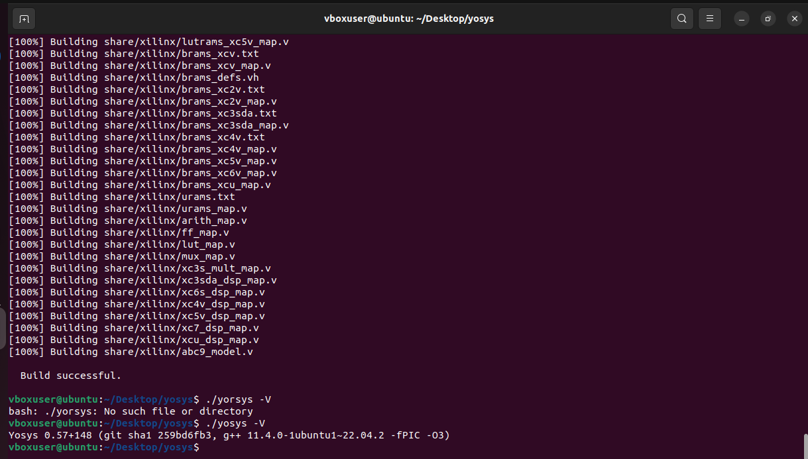
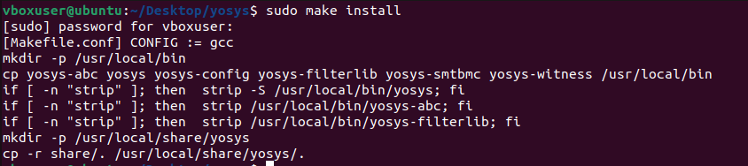
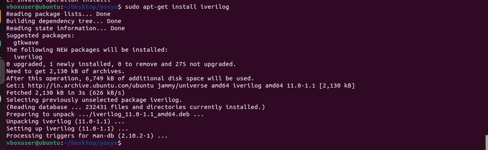
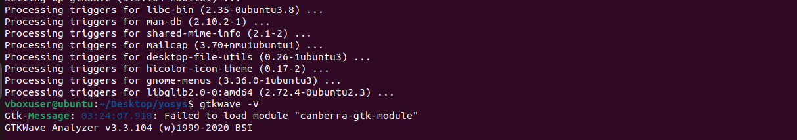
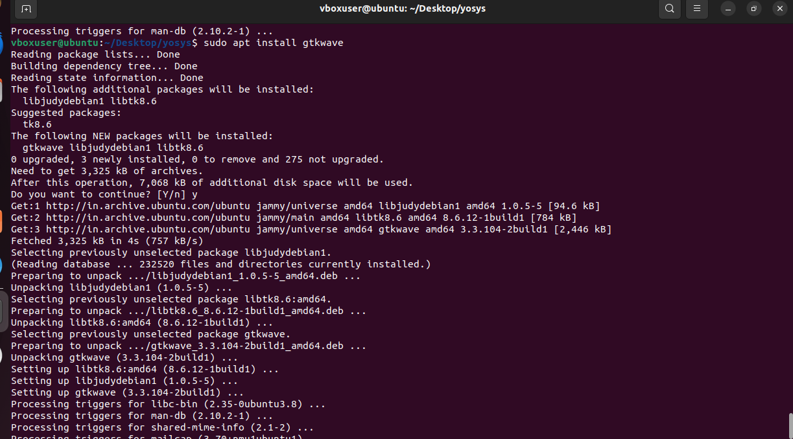
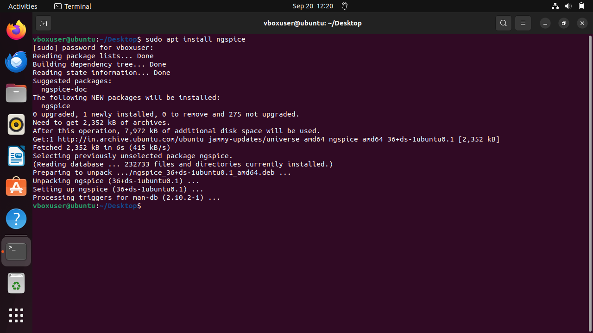
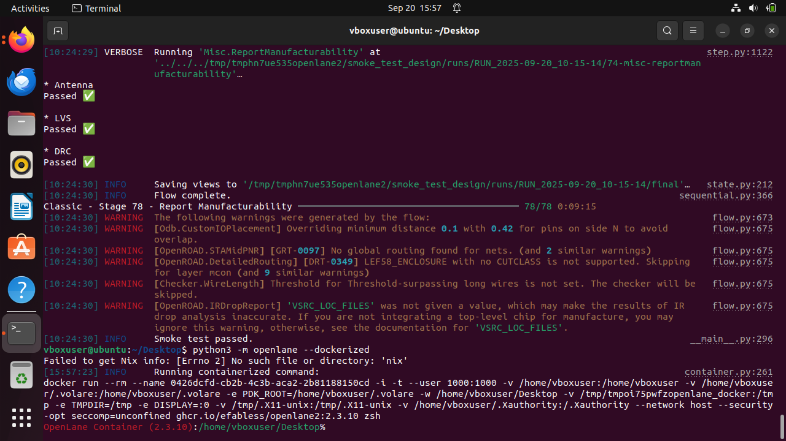

# RISC-V-SoC-Tapeout-VSD

# Tools Installation
## <ins>All the instructions for installation of required tools can be found here:</ins>
System Requirements

    6 GB RAM
    50 GB HDD
    Ubuntu 20.04 or higher
    4 vCPU

# vbox extra tools for sudo permission/identification

    $ sudo apt update
    $ sudo apt install build-essential dkms linux-headers-$(uname -r)
    $ cd /media/spatha/VBox_GAs_7.2.2/
    $ ./autorun.sh

TOOL CHECK
# Yosys

      $ sudo apt-get update
      
      $ git clone https://github.com/YosysHQ/yosys.git
      $ cd yosys
      $ sudo apt install make               # If make is not installed
      $ sudo apt-get install build-essential clang bison flex \
          libreadline-dev gawk tcl-dev libffi-dev git \
          graphviz xdot pkg-config python3 libboost-system-dev \
          libboost-python-dev libboost-filesystem-dev zlib1g-dev
      $ make config-gcc
      $ git submodule update --init --recursive
      $ make clean
      $ make -j$(nproc)
      $ sudo make install

  
  
  # Iverilog

    $ sudo apt-get update
    $ sudo apt-get install iverilog

    
# gtkwave

    $ sudo apt-get update
    $ sudo apt install gtkwave

# ngspice installation

     $ sudo apt update
     $ sudo apt install ngspice

# magic vlsi
    $ sudo apt-get install m4
    $ sudo apt-get install tcsh
    $ sudo apt-get install csh
    $ sudo apt-get install libx11-dev
    $ sudo apt-get install tcl-dev tk-dev
    $ sudo apt-get install libcairo2-dev
    $ sudo apt-get install mesa-common-dev libglu1-mesa-dev
    $ sudo apt-get install libncurses-dev
    git clone https://github.com/RTimothyEdwards/magic
    cd magic
    ./configure
    make
    make install

# open lane 
for the mismatch versions

        $sudo apt-get update
        $sudo apt-get upgrade
        $ sudo apt install -y build-essential python3 python3-venv python3-pip python3-tk curl make git
 
 Installing Docker
 Remove old installations
        $sudo apt-get remove docker docker-engine docker.io containerd runc
<ins> Installation of requirements </ins> 
        $ sudo apt-get update
        $ sudo apt-get install \
           ca-certificates \
           curl \
           gnupg \
           lsb-release
 # Add the keyrings of docker
        $ sudo mkdir -p /etc/apt/keyrings
        curl -fsSL https://download.docker.com/linux/ubuntu/gpg | sudo gpg --dearmor -o /etc/apt/keyrings/docker.gpg
# <ins>  Add the package repository </ins> 
        echo \
           "deb [arch=$(dpkg --print-architecture) signed-by=/etc/apt/keyrings/docker.gpg] https://download.docker.com/linux/ubuntu \
           $(lsb_release -cs) stable" | sudo tee /etc/apt/sources.list.d/docker.list > /dev/null
# <ins> Update the package repository</ins> 
        $ sudo apt-get update

# <ins> Install Docker</ins> 
        $ sudo apt-get install docker-ce docker-ce-cli containerd.io docker-compose-plugin

# <ins> Check for installation </ins> 
        $ sudo docker run hello-world

## making it with out root 
        $ sudo groupadd docker
        $ sudo usermod -aG docker $USER
        $ sudo reboot # REBOOT!
# checking docker installation
        $ docker run hello-world

# checking installation versions
        $ docker --version
        $ python3 --version
        $ python3 -m pip --version
# DOWNLOAD OPEN LANE USING PIP
        $ python3 -m pip install openlane
# run smoke test
        $ python3 -m openlane --dockerized --smoke-test
# open the openlane environment
        $ python3 -m openlane --dockerized

